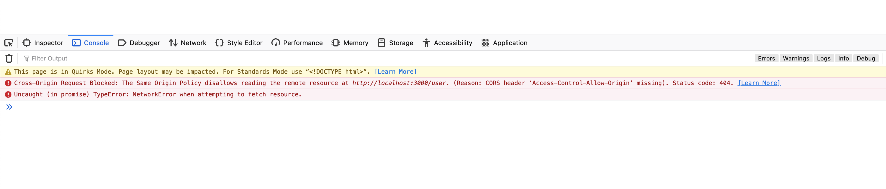
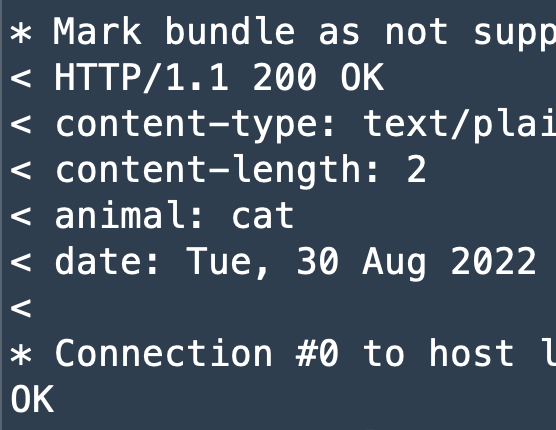

# Axum service checklist

```bash
make build debug=1 # cargo build
make build # cargo build --release
```

## Checklist

First step is uncommenting the tests in the workflows, check out `.github/workflows/ci.yml`.

- [ ] Create a hello word route on GET:`/hello-word` and write tests for it. Check out the `src/test.rs` file.

- [ ] Serve static files by serving the folder `resources`. Should be able to access `http://localhost:3000/static/great-wave.jpg` and return the image file:


- [ ] Fix the CORS issue on the frontend (http://localhost:4000).



- [ ] Create a middleware to extend the headers and add a new header with a key as "animal" and value as random value between: "dog", "cat", "monkey" and "sloth".



- [ ] Implement a route GET:`/user` that parses a local JSON file `user.json` and returns a response with content-type "application/json" and with the body as:

```json
{
	"name": "Emil",
	"age": 7,
	"email": "emil@viaplaygroup.com"
}
```

- [ ] Implement a route GET:`/users` that parses a local JSON file `users.json` and returns a response with content-type "application/json" and with the body as:

```json
[
	{
		"name": "Emil",
		"age": 7,
		"email": "emil@viaplaygroup.com"
	},
	{
		"name": "Pipi",
		"age": 7,
		"email": "pipi@viaplaygroup.com"
	}
]
```

- [ ] Implement a route GET:`/dog` that makes a request to https://dog.ceo/api/breeds/image/random , parses the response and return the property `message` as:


```json
{
	"dog": "https://images.dog.ceo/breeds/malinois/n02105162_299.jpg"
}
```

- [ ] Implement a route GET:`/dog?download=true` that makes a request to https://dog.ceo/api/breeds/image/random , parses the response and download the image to the resources folder and return the path in the response body, example:


```json
{
	"dog": "http://localhost:3000/static/malinois/n02105162_299.jpg"
}
```

## Working with repo

We use `Make` as a primary build tool. Here are the most important commands,
others you will find in `Makefile`.

#### `make build`

Installs dependencies and build it.

#### `make docker-build`

Builds a Docker image for the service.

#### `make test`

Runs all the test suits: API, integration and unit tests.
